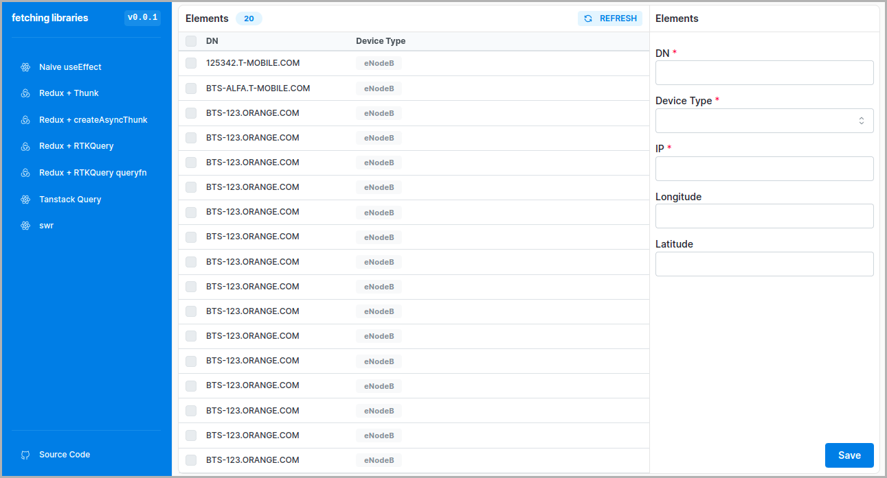

<div align="center">

# 🎆 Frontend Fetching Techniques

Frontend Fetching Techniques Comparison

[](https://react.dev/)
[](https://redux.js.org/)
[](https://www.typescriptlang.org/docs/handbook/intro.html)
[](https://prettier.io/docs/en/index.html)
[](https://testing-library.com/docs/react-testing-library/intro/)

</div>



## About 📝

This projects was meant to be a case study for comparing various fetching techniques on the frontend.

On the frontend we have the same view implemented using different techniques.

### Frontend 🪟

Frontend is using multiple libraries for fetching/caching data from the server:

- manual redux/thunk approach
- createAsyncThunk approach
- redux rtkquery approach
- tanstack query approach
- swr approach

There is `api` module that defines all consumed endpoints. It is anti-corruption layer that transforms data fetched from the backend into internal types.

For development pursposes `msw` is used so the frontend could have been developed without backend.

## Development 👨‍💻

- run `npm run dev` to run frontend app
- run `npm run test` to run tests
- run `npm run lint` to run linter
- run `npm run typecheck` to run typechecking

### Upgrading packages 🆙

### Mocks 🐾

Disable mocks by commenting this line in `main.tsx`:

```
setupMocks(); // Comment out to disable mocks
```

## Notes 📋️

- I will name `tanstack-query`, `rtk-query` and `swr` as modern data fetching in the notes.
- I am not sure if it's correct way of refetching with _modern data fetching_ libraries. Probably it should be loaded in the background without showing loading spinner.
- To have proper comparison I would need to disable retrying on failure for _modern data fetching_. Or at least unify them. `tanstack-query` has the best options out of the box in my opinion. I like incremental time for retrying.
- Error handling with current `api` directory is not great. When getting data from the backend that has incorrect format and can't be mapped we get `ApiError` without any details. It's hard to debug. Maybe `zod` would be a good solution for this problem? Or alternatively we could wrap `mapper` with try catch?
  - Edit `getElements` mock to see the problem.
- The `elementIdsBeingDeleted` object could be merged with regular `data` object so that each `element` has `isBeingDeleted: boolean` value.
- Problem with api that when there is some error (even on client side) then there will be `Internal Server Error` error. Hard to debug. For example if there is an error on mapper side. Investigate if `zod` would solve the issue.
- RTK Query is hard with all those types. It feels overcomplicated and overengineering. A lot of fighting with typescript here, e.g. defining custom `queryFn`.
- Initially this was a big Nx monorepo. I've realized that my grug brain is not capable to maintaining it. There was no reason to keep complexity. Not it is a simple vite app.
  - Used vite and not cra as there will be problem with migrating msw to v2 for jest (and cra in general). I guess it's over for cra.

## Updating strategy 🔝

```
npx npm-check-updates --interactive --format group
```

## Roadmap 🛣️🎯

- [ ] `getElements` api endpoint on frontend
  - [x] tests
  - [x] mocks with msw
  - [ ] expand api with filtering and sorting
- [ ] Fetching data and displaying it
  - [x] Using simple useEffect with hook
  - [x] Using redux thunk
  - [x] Using redux createAsyncThunk
  - [x] Using redux rtk-query
  - [x] Using tanstack-query
  - [x] Using swr
  - [x] refetching data
  - [ ] Testing each view for loading data
- [x] `deleteElement` api endpoint on frontend
  - [x] tests
  - [x] mocks with msw
- [x] Deleting element from ui using redux
  - [x] Using simple useEffect with hook
  - [x] Using redux thunk
  - [x] Using redux createAsyncThunk
  - [x] using redux rtk-query
  - [x] Using tanstack-query
  - [x] Using swr
- [x] `createElement` api endpoint on frontend
  - [x] tests
  - [x] mocks with msw
- [x] Creating element from ui using redux
  - [x] Using simple useEffect with hook
  - [x] Using redux thunk
  - [x] Using redux createAsyncThunk
  - [x] using redux rtk-query
  - [x] Using tanstack-query
  - [x] Using swr
- [ ] `updateElement` api endpoint on frontend
  - [ ] tests
  - [ ] mocks with msw
- [ ] Error case
  - [ ] Deleting [feedback message]
  - [ ] Creating [feedback message]
- [ ] Updating element from ui
  - [ ] Using simple useEffect with hook
  - [ ] Using redux thunk
  - [ ] Using redux createAsyncThunk
  - [ ] using redux rtk-query
  - [ ] Using tanstack-query
  - [ ] Using swr
- [x] add total count to the table views
- [ ] investigate usage od `zod` in api
- [x] investigate usage of `redux-hook-form` on update/create forms
- [ ] implement simple backend api with sqlite db (separate repo)
  - [ ] get elements endpoint
  - [ ] create element endpoint
  - [ ] delete clement endpoint
  - [ ] custom response
  - [ ] configure logger
  - [ ] generate api docs
- [ ] investigate integration tests with cypress/playwright in addition to rtl
- [ ] toast notifications with https://react-hot-toast.com/
